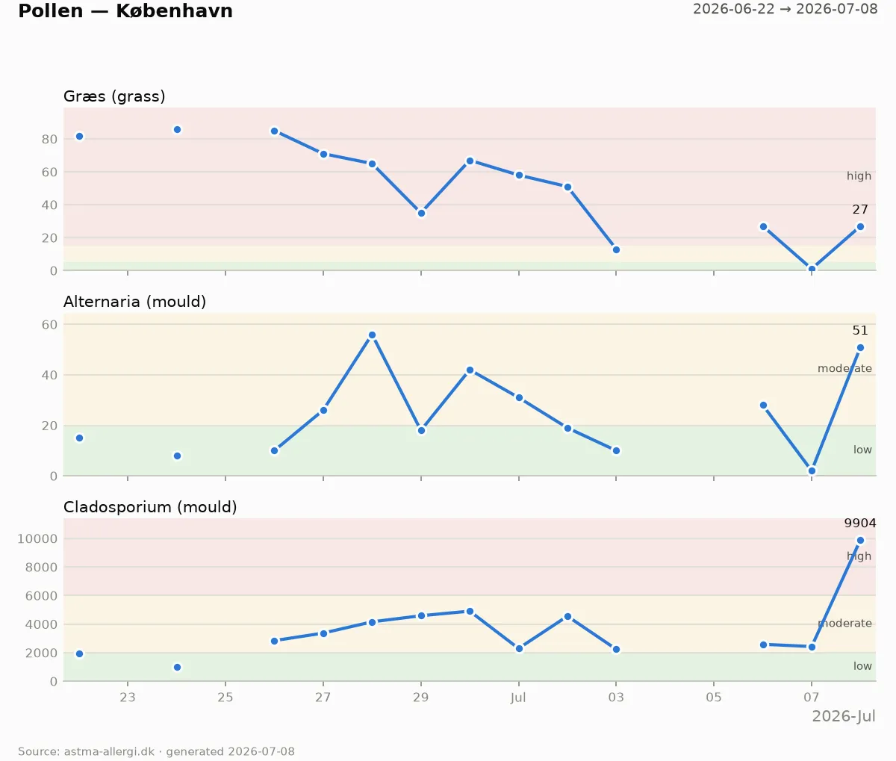

# denmark_pollen

Daily Copenhagen pollen counts from [astma-allergi.dk](https://www.astma-allergi.dk),
logged to `pollen.jsonl` and charted to `pollen.webp`.



## Scripts

- `fetch_pollen.py` — fetches today's counts and appends one JSONL row per
  measurement day (stdlib only).
- `viz_pollen.py` — renders `pollen.jsonl` as a small-multiples chart (webp by
  default; the `--out` extension picks the format), one panel per in-season pollen
  type, with the site's low/moderate/high thresholds as background bands. Needs
  matplotlib.
- `daily.py` — cron entry point: runs the fetch, and when a new measurement
  arrived, re-renders the chart, commits `pollen.jsonl` + `pollen.webp`, and
  pushes to GitHub. With no new data it prints a message and exits 0 without
  touching git.

## Setup

```sh
python3 -m venv .venv
.venv/bin/pip install -r requirements.txt
```

## Daily cron

```cron
30 13 * * * python3 /Users/neoneye/git/denmark_pollen/daily.py
```

## Health check

```sh
python3 daily.py --health            # exit 0 = pipeline healthy, 1 = problems
python3 daily.py --health --max-age-hours 48
```

Checks: venv present, `pollen.jsonl` readable, data fresher than the threshold
(default 30 h). When stale it probes the live feed to distinguish "source
hasn't published" (OK) from "site down" or "cron not recording" (FAIL).

## Tests

```sh
python3 test_fetch_pollen.py
python3 test_daily.py
.venv/bin/python3 test_viz_pollen.py
```
