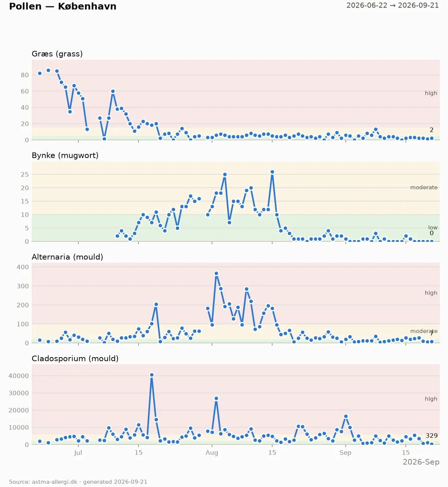

# denmark_pollen

Daily Copenhagen pollen counts from [astma-allergi.dk](https://www.astma-allergi.dk),
logged to `pollen.jsonl` and charted to `pollen.webp`.



## Scripts

- `fetch_pollen.py` — fetches today's counts and appends one JSONL row per
  measurement day (stdlib only).
- `viz_pollen.py` — renders `pollen.jsonl` as a small-multiples chart (webp by
  default; the `--out` extension picks the format), one panel per in-season pollen
  type, with the site's low/moderate/high thresholds as background bands. Needs
  matplotlib.
- `daily.py` — unattended entry point: runs the fetch, and when a new
  measurement arrived, re-renders the chart, commits `pollen.jsonl` +
  `pollen.webp`, and pushes to GitHub. With no new data it prints a message and
  exits 0 without touching git. It renders with `.venv/bin/python3` when that
  venv exists and with the running interpreter otherwise, so the same script
  works locally and on a CI runner.

## Setup

```sh
python3 -m venv .venv
.venv/bin/pip install -r requirements.txt
```

## Scheduling

`.github/workflows/daily.yml` runs `daily.py` on GitHub Actions and pushes the
result back to `main` — no machine of mine has to be awake. Three attempts a day
(12:00, 16:00, 19:00 UTC) because GitHub cron is UTC-only with no DST, queues
scheduled runs 5–30 minutes late, and can skip them under load; the fetch is
idempotent, so extra runs cost nothing. "Run workflow" on the Actions tab
triggers it by hand.

Two caveats worth knowing:

- GitHub disables a public repo's scheduled workflows after **60 days without
  commit activity**. Off-season the source stops publishing, `daily.py` stops
  committing, and the schedule would switch itself off before next spring — so
  the workflow makes an empty keepalive commit whenever the last commit is 45+
  days old.
- Scheduled runs are best-effort. If the exact minute matters, this is the wrong
  tool; for a once-a-day measurement it does not.

To run it locally instead:

```cron
30 13 * * * python3 /Users/neoneye/git/denmark_pollen/daily.py
```

## Health check

```sh
python3 daily.py --health            # exit 0 = pipeline healthy, 1 = problems
python3 daily.py --health --max-age-hours 48
```

Checks: the viz interpreter can import matplotlib, `pollen.jsonl` readable,
data fresher than the threshold (default 30 h). When stale it probes the live
feed to distinguish "source hasn't published" (OK) from "site down" or "not
recording" (FAIL). The daily workflow runs it as its last step, so a broken
pipeline turns the run red.

## Tests

```sh
python3 test_fetch_pollen.py
python3 test_daily.py
.venv/bin/python3 test_viz_pollen.py
```

All three are offline — no network, no subprocesses, no git.
`.github/workflows/tests.yml` runs them on every push and pull request.
